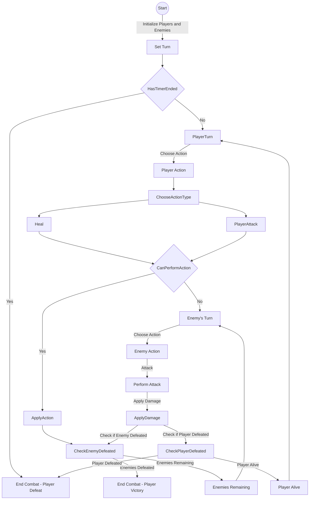
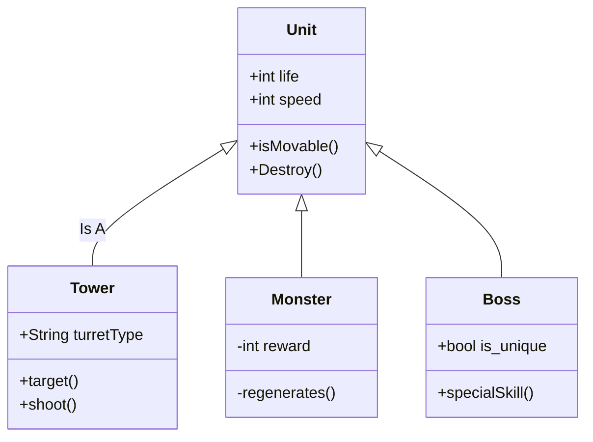

# Proeve van Bekwaamheid Marine 

In deze repository vind je de informatie over het examen project.

# Meet the team

* Milan Breuren (Product owner & dev)
* Zakarai El Ghoul (Lead dev)
* Nanne Veldhuijzen van Zanten (SCRUM Master & dev)
* Lennard Hartog (3D artist)
* Yessie Blaas (2D artist)
* Isa Schulte (Lead 3D artist & notulist)
* Jesper Ceria (Lead 2D artist)

# De Opdracht

De opdracht die wij hebben gekregen was: Ontwikkel een maritieme strategiegame met minimaal 2 verschillende scenario’sof levels.De speler(s) heeft/hebben in de game detaak om schepen te herkennen en deze op de juiste manier strategisch in te zetten. De strategische inzet is op basis van hun typeen daarbij horende eigenschappen en functionaliteit. Door deze strategische inzet moet het doel van de game of het level worden bereikt. De game moet vooral draaien omherkenbare, vriendschappelijke, Nederlandse en internationale(NAVO) marineschepen. Jullie doen zelf onderzoek naar de verschillende schepen die interessant kunnen zijn om in de game te verwerken. Jullie zorgen ervoordat de uit gewerkte game-mechanics goed aansluiten op de werkelijke toepassing van de gekozen schepen.

Het doel voor de klant is om jongeren aan te trekken tot de marine, dat willen wij bereiken door het spel simpel te maken en toegankelijk voor jongeren.
We hebben besloten om een strategisch kaartspel te maken in Unreal Engine 5 waar de speler goed moet focusen om de goede keuzes te kunnen maken om zo de vijand te kunnen verslaan. Tijdens de game leert de speler de verschillende sterktes en zwaktes van de schepen waar de speler mee speelt. Op deze manier willen we de speler interesse laten tonen in de marine. 

Lees een complete uitleg over het spel [hier](https://github.com/Zakaria-ElGhoul/PvB-Marine/wiki/Functioneel-ontwerp)

# Geproduceerde Game Onderdelen

Hier laten wij per teamlid ons meest belangrijke onderdeel van het spel zien. In het [technisch ontwerp](https://github.com/Zakaria-ElGhoul/PvB-Marine/wiki/Technisch-ontwerp) gaan wij hier verder opin.

Zakaria (dev):
  * [Buoyancy Shader](https://github.com/erwinhenraat/VoorbeeldExamenRepo/tree/master/src/some)
  * [A.I. BlackBoard](https://github.com/erwinhenraat/VoorbeeldExamenRepo/tree/master/src/mechanic_x)
  * [Turn System](https://github.com/erwinhenraat/VoorbeeldExamenRepo/tree/master/src/mechanic_y)
  * [U.I. Shader]

Milan (dev):
  * [Card System]
  * [Action Visuals](https://github.com/erwinhenraat/VoorbeeldExamenRepo/tree/master/assets/monsters)
  * [Enemy A.I.]
  * [Attack System]

Nanne (dev):
  * [Inspect Cards](https://github.com/erwinhenraat/VoorbeeldExamenRepo/tree/master/src/beautifull)
  * [Mana System]
  * [Select Target System] 

## Wave System by Student X

Latin professor at Hampden-Sydney College in Virginia, looked up one of the more obscure Latin words, consectetur, from a Lorem Ipsum passage, and going through the cites of the word in classical literature, discovered the undoubtable source. Lorem Ipsum comes from sections 1.10.32 and 1.10.33 of "de Finibus Bonorum et Malorum" (The Extremes of Good and Evil) by Cicero, written in 45 BC. This book is a treatise on the theory of ethics, very popular during the Renaissance. The first line of Lorem Ipsum, "Lorem ipsum dolor sit amet..", comes from a line.

### flowchart voor turn based combat system:

### class diagram voor game entities:

## Some other Mechanic X by Student X

Contrary to popular belief, Lorem Ipsum is not simply random text. It has roots in a piece of classical Latin literature from 45 BC, making it over 2000 years old. Richard McClintock, a Latin professor at Hampden-Sydney College in Virginia, looked up one of the more obscure Latin words, consectetur, from a Lorem Ipsum passage, and going through the cites of the word in classical literature, discovered the undoubtable source. Lorem Ipsum comes from sections 1.10.32 and 1.10.33 of "de Finibus Bonorum et Malorum" (The Extremes of Good and Evil) by Cicero, written in 45 BC. This book is a treatise on the theory of ethics, very popular during the Renaissance. The first line of Lorem Ipsum, "Lorem ipsum dolor sit amet..", comes from a line in section 1.10.32.

## Some other Mechanic Y by Student X

Contrary to popular belief, Lorem Ipsum is not simply random text. It has roots in a piece of classical Latin literature from 45 BC, making it over 2000 years old. Richard McClintock, a Latin professor at Hampden-Sydney College in Virginia, looked up one of the more obscure Latin words, consectetur, from a Lorem Ipsum passage, and going through the cites of the word in classical literature, discovered the undoubtable source. Lorem Ipsum comes from sections 1.10.32 and 1.10.33 of "de Finibus Bonorum et Malorum" (The Extremes of Good and Evil) by Cicero, written in 45 BC. This book is a treatise on the theory of ethics, very popular during the Renaissance. The first line of Lorem Ipsum, "Lorem ipsum dolor sit amet..", comes from a line in section 1.10.32.

## Water Shader by Student Y

Contrary to popular belief, Lorem Ipsum is not simply random text. It has roots in a piece of classical Latin literature from 45 BC, making it over 2000 years old. Richard McClintock, a Latin professor at Hampden-Sydney College in Virginia, looked up one of the more obscure Latin words, consectetur, from a Lorem Ipsum passage, and going through the cites of the word in classical literature, discovered the undoubtable source. Lorem Ipsum comes from sections 1.10.32 and 1.10.33 of "de Finibus Bonorum et Malorum" (The Extremes of Good and Evil) by Cicero, written in 45 BC. This book is a treatise on the theory of ethics, very popular during the Renaissance. The first line of Lorem Ipsum, "Lorem ipsum dolor sit amet..", comes from a line in section 1.10.32.

## Some textured and rigged model by Student Y

Contrary to popular belief, Lorem Ipsum is not simply random text. It has roots in a piece of classical Latin literature from 45 BC, making it over 2000 years old. Richard McClintock, a Latin professor at Hampden-Sydney College in Virginia, looked up one of the more obscure Latin words, consectetur, from a Lorem Ipsum passage, and going through the cites of the word in classical literature, discovered the undoubtable source. Lorem Ipsum comes from sections 1.10.32 and 1.10.33 of "de Finibus Bonorum et Malorum" (The Extremes of Good and Evil) by Cicero, written in 45 BC. This book is a treatise on the theory of ethics, very popular during the Renaissance. The first line of Lorem Ipsum, "Lorem ipsum dolor sit amet..", comes from a line in section 1.10.32.

## Some beautifull script by Student Z

Contrary to popular belief, Lorem Ipsum is not simply random text. It has roots in a piece of classical Latin literature from 45 BC, making it over 2000 years old. Richard McClintock, a Latin professor at Hampden-Sydney College in Virginia, looked up one of the more obscure Latin words, consectetur, from a Lorem Ipsum passage, and going through the cites of the word in classical literature, discovered the undoubtable source. Lorem Ipsum comes from sections 1.10.32 and 1.10.33 of "de Finibus Bonorum et Malorum" (The Extremes of Good and Evil) by Cicero, written in 45 BC. This book is a treatise on the theory of ethics, very popular during the Renaissance. The first line of Lorem Ipsum, "Lorem ipsum dolor sit amet..", comes from a line in section 1.10.32.

## Some other Game object by Student Z

Contrary to popular belief, Lorem Ipsum is not simply random text. It has roots in a piece of classical Latin literature from 45 BC, making it over 2000 years old. Richard McClintock, a Latin professor at Hampden-Sydney College in Virginia, looked up one of the more obscure Latin words, consectetur, from a Lorem Ipsum passage, and going through the cites of the word in classical literature, discovered the undoubtable source. Lorem Ipsum comes from sections 1.10.32 and 1.10.33 of "de Finibus Bonorum et Malorum" (The Extremes of Good and Evil) by Cicero, written in 45 BC. This book is a treatise on the theory of ethics, very popular during the Renaissance. The first line of Lorem Ipsum, "Lorem ipsum dolor sit amet..", comes from a line in section 1.10.32.

