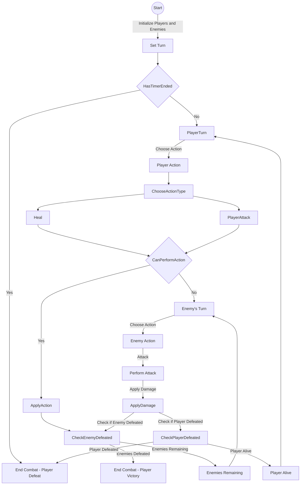
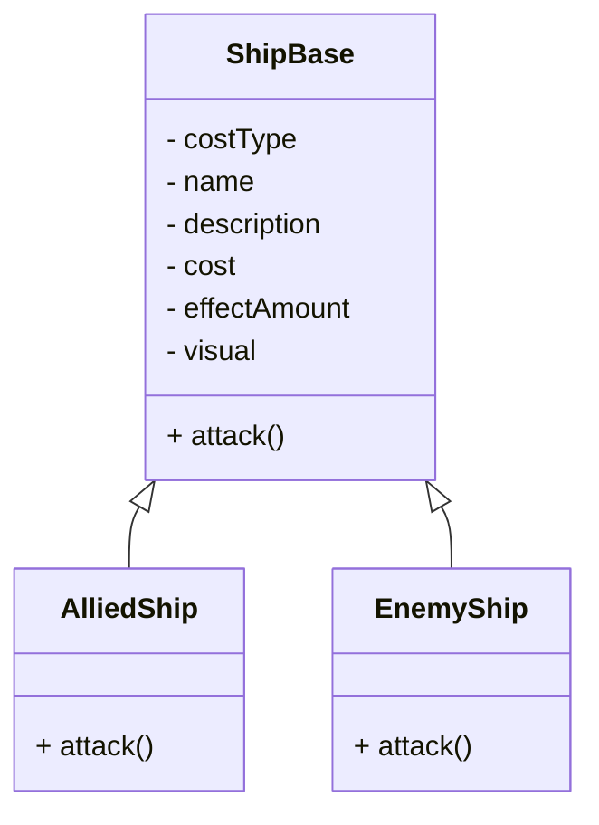

# Proeve van Bekwaamheid Marine 

In deze repository vind je de informatie over het examen project.

# Meet the team

* Milan Breuren (Product owner & dev)
* Zakaria El Ghoul (Lead dev)
* Nanne Veldhuijzen van Zanten (SCRUM Master & dev)
* Lennard Hartog (3D artist)
* Yessie Blaas (2D artist)
* Isa Schulte (Lead 3D artist & notulist)
* Jesper Ceria (Lead 2D artist)

# De Opdracht

De opdracht die wij hebben gekregen was: Ontwikkel een maritieme strategiegame met minimaal 2 verschillende scenario’s of levels. De speler heeft in de game de taak om schepen te herkennen en deze op de juiste manier strategisch in te zetten. De strategische inzet is op basis van hun type en daarbij horende eigenschappen en functionaliteit. Door deze strategische inzet moet het doel van de game of het level worden bereikt. De game moet vooral draaien om herkenbare, vriendschappelijke, Nederlandse en internationale(NAVO) marineschepen. Jullie doen zelf onderzoek naar de verschillende schepen die interessant kunnen zijn om in de game te verwerken. Jullie zorgen ervoor dat de uit gewerkte game-mechanics goed aansluiten op de werkelijke toepassing van de gekozen schepen.

Het doel voor de klant is om jongeren aan te trekken tot de marine, dat willen wij bereiken door het spel simpel te maken en toegankelijk voor jongeren.
We hebben besloten om een strategisch kaartspel te maken in Unreal Engine 5 waar de speler goed moet focusen om de goede keuzes te kunnen maken om zo de vijand te kunnen verslaan. Tijdens de game leert de speler de verschillende sterktes en zwaktes van de schepen waar de speler mee speelt. Op deze manier willen we de speler interesse laten tonen in de marine. 

Lees een complete uitleg over het spel [hier](https://github.com/Zakaria-ElGhoul/PvB-Marine/wiki/Functioneel-ontwerp)

# Geproduceerde Game Onderdelen

Hier laten wij per teamlid ons meest belangrijke onderdeel van het spel zien. In het [technisch ontwerp](https://github.com/Zakaria-ElGhoul/PvB-Marine/wiki/Technisch-ontwerp) gaan wij hier verder op in.

Zakaria (dev):
  * [Buoyancy Shader](https://blueprintue.com/blueprint/vs0mdc-f/)
  * [A.I. BlackBoard]()
  * [Turn System]()
  * [U.I. Shader]()

Milan (dev):
  * [Card System](https://blueprintue.com/blueprint/57a-2_4j/)
  * [Action Visuals]()
  * [Enemy A.I.]()
  * [Attack System]()

Nanne (dev):
  * [Inspect Cards](https://blueprintue.com/blueprint/1pgupew1/)
  * [Resource System](https://blueprintue.com/blueprint/90r_fd0s/)
  * [Select Target System](https://blueprintue.com/blueprint/zbj60y91/)

## Enemy AI

Enemy AI heeft 3 states: DrawCard, PlayCard en Attack. In de eerste state kiest de AI één van de beschikbare kaarten uit, hij kijkt ook of hij genoeg 'mana' heeft om ze te gebruiken. Als hij dat allemaal gedaan hebt, dan slaat hij al die waardes op om ze vervolgens in de volgende state te gebruiken. In playCard pakt hij een willekeurige schip om vervolgens zijn kaart effect te boosten. Als dat gedaan is, dan gaat hij over naar attack, in attack kiest hij een willekeurige doelwit uit. nadat hij dat gedaan heeft, kan hij niet meer zijn behavior tree meer afgaan totdat de speler zijn zet heeft gedaan.

### flowchart voor turn based combat system:

### class diagram voor game entities:

## Resource System

We hebben een resource systeem voor het spel gemaakt om de speler meer na te laten denken over wat hij kan doen in een zet. Elke kaart heeft een bepaalde cost om te kunnen spelen hierdoor moet je goed nadenken wat je in je huidige zet en volgende zet kan spelen om de vijand te slim af te zijn. Het werkt zo; aan het begin van het spel krijgen beide spelers 5 "mana". Telkens als het weer de beurt van de speler is dan komt er 5 "mana" bij. Dus de speler hebben elke turn een gelijk aantal aan resources. Als je genoeg resources heb en een kaart speel dan gaan de resources van die gespeelde kaart van je huidige resources af en eindigt je beurt. Als de turn switched dan worden je resources weer bd tot een maximaal aantal van 30.

[Blueprint](https://blueprintue.com/blueprint/_84l9xv1/)

